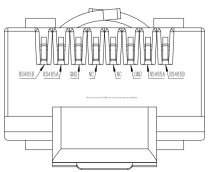
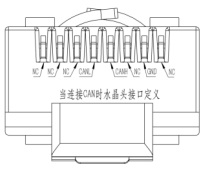
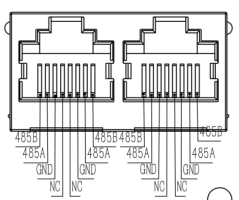
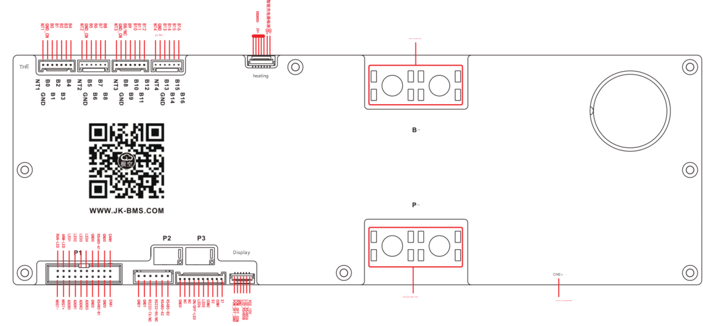

# **Multiple JK-BMS Modbus RJ485 integration**

## **Principle of operation**

### **Communication Module Ports**

#### **Connections and wiring**

##### **Communication board**

Configuration of the Communication Board presented below is verified and validated.

( **Warning:** Some available documents and manuals contain incorrect description of ports)

||
|-|
||

| Port 1 (UART1) RJ485 cable: | CAN Port cable: |
|-|-|
|  |  |

| Port 2 (UART2) wiring: |
|-|
||

##### **JK-BMS board**

|JK-BMS board connectors:|
|-|
||

|JK-BMS wiring:|
|-|
||

#### **UART2 configuration**

In the last software version only two protocols are available:

- **001** - JK BMS RS485 Modbus V1.0
- **015** - UART Protocol 015

Protocols are set  not selectable by BLE configuration or Modbus.

#### **UART1 configuration**

The following protocols are supported on the RJ485-1 (UART1) port:

(*italic options ane not settable*)

- **000** - 4G-GPS Remote module Common protocol V4.2
- **001** - **JK BMS RS485 Modbus V1.0**
- **002** - NIU U SERIES
- **003** - China tower shared battery cabinet V1.1
- **004** - PACE_RS485_Modbus_V1.3
- **005** - PYLON_low_voltage_Protocol_RS485_V3.5
- **006** - Growatt_BMS_RS485_Protocol_1xSxxP_ESS_Rev2.01
- **007** - Voltronic_Inverter_and_BMS_485_communication_protocol_20200...
- **008** - China tower shared battery cabinet V2.0
- **009** - WOW_RS485_Modbus_V1.3
- **010** - JK BMS LCD Protocol V2.0
- **011** - *UART1 User customization*
- **012** - *UART2 User customization*
- **013** - (9600)JK BMS RS485 Modbus V1.0
- **014** - (9600)PYLON_low_voltage_Protocol_RS485_V3.5
- **015** - *UART Protocol 015*

#### **CAN port configuration**

The following CAN protocols are supported on the CAN port:

(*italic options ane not settable*)

- **000** - JK BMS CAN Protocol (250K) V2.0
- **001** - Deye Low-voltage hybrid inverter CAN communication protocol V1.0
- **002** - PYLON-Low-voltage-V1.2
- **003** - Growatt BMS CAN-Bus-protocol-low-voltage_Rev_05
- **004** - Victron_CANbus_BMS_protocol_20170717
- **005** - MEGAREVO_Hybird_BMSCAN_Protocol_V1.0
- **006** - JK BMS CAN Protocol (500K) V2.0
- **007** - INVT BMS CAN Bus protocol V1.02
- **008** - GoodWe LV BMS Protocol (EX/EM/S-BP/BP)
- **009** - FSS-ConnectingBat-Tl-en-10 | Version 1.0
- **010** - MUST PV1800F-CAN communication Protocol1.04.04
- **011** - LuxpowerTek Battery CAN protocol V01
- **012** - *CAN BUS User customization*
- **013** - *CAN BUS Protocol 013*
- **014** - *CAN BUS Protocol 014*


### **Communication protocol**

#### **UART2 usage**

If Device Address is set to 0x00 (by the switches) then UART2 protocol is set to **015** and the master mode of the JK BMS RS485 Modbus V1.0 protocol is set.

During every 15 sec. status of the master device is send to the bus, followed by data request addressed to the all 15 slaves:

```
master    >>> 55 AA EB 90 02 00 C7 0C C7 0C C7 0C C7 0C C7 0C C7 0C C7 0C C7 0C C7 0C C7 0C C8 0C C7 0C C8 0C C7 0C C8 0C C8 0C 00 00 00 00 00 00 00 00 00 00 00 00 00 00 00 00 00 00 00 00 00 00 00 00 00 00 00 00 00 00 00 00 FF FF 00 00 C7 0C 01 00 00 01 3E 00 3B 00 3D 00 3B 00 3E 00 3B 00 3D 00 3B 00 3E 00 3C 00 3E 00 3C 00 3E 00 3D 00 3F 00 3D 00 00 00 00 00 00 00 00 00 00 00 00 00 00 00 00 00 00 00 00 00 00 00 00 00 00 00 00 00 00 00 00 00 BD 00 00 00 00 00 70 CC 00 00 00 00 00 00 00 00 00 00 A9 00 AD 00 00 00 08 00 00 00 00 41 6B 18 03 00 90 CA 04 00 00 00 00 00 FB 01 00 00 64 00 00 00 D8 FF 03 00 01 01 00 00 00 00 00 00 00 00 00 00 00 00 00 00 FF 00 01 00 00 00 AF 03 00 00 00 00 5E 48 3F 40 00 00 00 00 71 14 00 00 00 01 01 01 00 06 00 00 72 70 26 00 00 00 00 00 BD 00 AE 00 A8 00 AB 03 7F B8 1F 09 05 00 00 00 80 51 01 00 00 00 02 03 A5 67 00 00 00 00 00 00 00 FE FF 7F DC 2F 01 01 B0 0F 00 00 00 C5
master    >>> 00 10 16 20 00 01 05 9A
master    >>> 55 AA EB 90 01 00 AC 0D 00 00 14 0A 00 00 3C 0A 00 00 42 0E 00 00 FC 0D 00 00 0A 00 00 00 06 0E 00 00 28 0A 00 00 10 0E 00 00 AC 0D 00 00 C4 09 00 00 40 9C 00 00 03 00 00 00 3C 00 00 00 F0 49 02 00 2C 01 00 00 3C 00 00 00 05 00 00 00 E8 03 00 00 BC 02 00 00 58 02 00 00 BC 02 00 00 58 02 00 00 14 00 00 00 46 00 00 00 20 03 00 00 BC 02 00 00 10 00 00 00 01 00 00 00 01 00 00 00 01 00 00 00 90 CA 04 00 DC 05 00 00 B8 0B 00 00 00 00 00 00 00 00 00 00 00 00 00 00 00 00 00 00 00 00 00 00 00 00 00 00 00 00 00 00 00 00 00 00 00 00 00 00 00 00 00 00 00 00 00 00 00 00 00 00 00 00 00 00 00 00 00 00 00 00 00 00 00 00 00 00 00 00 00 00 00 00 00 00 00 00 00 00 00 00 00 00 00 00 00 00 00 00 00 00 00 00 00 00 00 00 00 00 00 00 00 00 00 00 00 00 00 00 00 00 00 00 00 00 00 00 00 00 00 00 00 00 00 00 00 00 00 00 00 00 00 00 00 00 00 00 00 00 60 E3 16 00 00 32 3C 32 18 FE FF FF FF 9F E9 1D 02 00 00 00 00 C7
master    >>> 00 10 16 1E 00 01 64 56
master    >>> 01 10 16 20 00 01 02 00 00 D6 F1
slave  01 <<< 55 AA EB 90 02 05 C4 0C C4 0C C4 0C C4 0C C4 0C C4 0C C4 0C C3 0C C4 0C C4 0C C4 0C C4 0C C4 0C C4 0C C4 0C C4 0C 00 00 00 00 00 00 00 00 00 00 00 00 00 00 00 00 00 00 00 00 00 00 00 00 00 00 00 00 00 00 00 00 FF FF 00 00 C4 0C 01 00 00 05 3A 00 37 00 3A 00 37 00 3A 00 38 00 3A 00 37 00 3B 00 39 00 3B 00 38 00 3B 00 3A 00 3C 00 3A 00 00 00 00 00 00 00 00 00 00 00 00 00 00 00 00 00 00 00 00 00 00 00 00 00 00 00 00 00 00 00 00 00 AE 00 00 00 00 00 3F CC 00 00 00 00 00 00 00 00 00 00 A7 00 AC 00 00 00 08 00 00 00 00 40 CA 14 03 00 90 CA 04 00 00 00 00 00 16 02 00 00 64 00 00 00 A8 FF 03 00 01 01 00 00 00 00 00 00 00 00 00 00 00 00 00 00 FF 00 01 00 00 00 A8 03 00 00 00 00 9C D7 3E 40 00 00 00 00 6C 14 00 00 00 01 01 01 00 06 00 00 F4 6B 26 00 00 00 00 00 AE 00 AB 00 A9 00 A4 03 80 B8 1F 09 03 00 00 00 80 51 01 00 00 00 01 00 49 6D 00 00 00 00 00 00 00 FE FF 7F DC 2F 01 01 B0 0F 00 00 00 2D
slave  01 <<< 01 10 16 20 00 01 04 4B
master    >>> 01 10 16 1E 00 01 02 00 00 D2 2F
slave  01 <<< 55 AA EB 90 01 05 AC 0D 00 00 14 0A 00 00 3C 0A 00 00 42 0E 00 00 FC 0D 00 00 0A 00 00 00 06 0E 00 00 28 0A 00 00 10 0E 00 00 AC 0D 00 00 C4 09 00 00 40 9C 00 00 03 00 00 00 3C 00 00 00 F0 49 02 00 2C 01 00 00 3C 00 00 00 05 00 00 00 E8 03 00 00 BC 02 00 00 58 02 00 00 BC 02 00 00 58 02 00 00 14 00 00 00 32 00 00 00 E8 03 00 00 20 03 00 00 10 00 00 00 01 00 00 00 01 00 00 00 01 00 00 00 90 CA 04 00 DC 05 00 00 B8 0B 00 00 00 00 00 00 00 00 00 00 00 00 00 00 00 00 00 00 00 00 00 00 00 00 00 00 00 00 00 00 00 00 00 00 00 00 00 00 00 00 00 00 00 00 00 00 00 00 00 00 00 00 00 00 00 00 00 00 00 00 00 00 00 00 00 00 00 00 00 00 00 00 00 00 00 00 00 00 00 00 00 00 00 00 00 00 00 00 00 00 00 00 00 00 00 00 00 00 00 00 00 00 00 00 00 00 00 00 00 00 00 00 00 00 00 00 00 00 00 00 00 00 00 00 00 00 00 00 00 00 01 00 00 00 00 00 00 00 60 E3 16 00 00 32 3C 32 18 FE FF FF FF 9F E9 1D 02 00 00 00 00 E6
slave  01 <<< 01 10 16 1E 00 01 65 87
master    >>> 02 10 16 20 00 01 02 00 00 C2 01
master    >>> 03 10 16 20 00 01 02 00 00 CF 91
master    >>> 04 10 16 20 00 01 02 00 00 E9 A1
master    >>> 05 10 16 20 00 01 02 00 00 E4 31
master    >>> 06 10 16 20 00 01 02 00 00 F0 C1
master    >>> 07 10 16 20 00 01 02 00 00 FD 51
master    >>> 08 10 16 20 00 01 02 00 00 BC A1
master    >>> 09 10 16 20 00 01 02 00 00 B1 31
master    >>> 0A 10 16 20 00 01 02 00 00 A5 C1
master    >>> 0B 10 16 20 00 01 02 00 00 A8 51
master    >>> 0C 10 16 20 00 01 02 00 00 8E 61
master    >>> 0D 10 16 20 00 01 02 00 00 83 F1
master    >>> 0E 10 16 20 00 01 02 00 00 97 01
master    >>> 0F 10 16 20 00 01 02 00 00 9A 91
```

more data can be foun in the [`/docs/log`](./docs/log) catalog of the JK-BMS project.

If Device Address is set to 1 - 15 (0x01 - 0x0F) then BMS is in the Modbus slave mode and protocol is set to **001**

#### **UART1 Usage**

Port RJ485-1 is always ( *required verification* ) in the slave mode, even if Device Address is 0x00.

Our Hass integration is using `JK BMS RS485 Modbus V1.0` (001) protocol.

 More information: [JK-BMS Modbus RS485 HASS ESPhome integration](https://gitlab.stn.pl/picoides-monitor/bms/jk-bms) 

### **Supported registers**

Our integration supports all documented ports

<details><summary> Jikong BMS RS485 Modbus Universal Protocol V1.1 - Click to expand</summary>

```
Register Map
Start address code offset Index Data type Length R/W Data content Content 			Unit Note Note
Address
Field HEX DEC Type Length 				Unit
0x1000  0x0000  0   UINT32  4   RW  Entering sleep voltage                              VolSmartSleep       mV
        0x0004  4   UINT32  4   RW  Cell undervoltage protection                        VolCellUV           mV
        0x0008  8   UINT32  4   RW  Cell undervoltage protection recovery               VolCellUVPR         mV
        0x000C  12  UINT32  4   RW  Cell overcharge protection                          VolCellOV           mV
        0x0010  16  UINT32  4   RW  Cell overcharge protection recovery voltage         VolCellOVPR         mV
        0x0014  20  UINT32  4   RW  Trigger balanced voltage difference                 VolBalanTrig        mV
        0x0018  24  UINT32  4   RW  SOC-100% voltage                                    VolSOC100%          mV
        0x001C  28  UINT32  4   RW  SOC-0% voltage                                      VolSOC0%            mV
        0x0020  32  UINT32  4   RW  Recommended charging voltage                        VolCellRCV          mV
        0x0024  36  UINT32  4   RW  Float charge voltage                                VolCellRFV          mV
        0x0028  40  UINT32  4   RW  Automatic shutdown voltage                          VolSysPwrOff        mV
        0x002C  44  UINT32  4   RW  Continuous charging current                         CurBatCOC           mA
        0x0030  48  UINT32  4   RW  Charge overcurrent protection delay                 TIMBatCOCPDly       S
        0x0034  52  UINT32  4   RW  Charge overcurrent protection release               TIMBatCOCPRDly      S
        0x0038  56  UINT32  4   RW  Continuous discharge current                        CurBatDcOC          mA
        0x003C  60  UINT32  4   RW  Discharge overcurrent protection delay              TIMBatDcOCPDly      S
        0x0040  64  UINT32  4   RW  Discharge overcurrent protection release            TIMBatDcOCPRDly     S
        0x0044  68  UINT32  4   RW  Short circuit protection release                    TIMBatSCPRDly       S
        0x0048  72  UINT32  4   RW  Maximum balancing current                           CurBalanMax         mA
        0x004C  76  INT32   4   RW  Charging over-temperature protection                TMPBatCOT           0.1°C
        0x0050  80  INT32   4   RW  Charge over temperature recovery                    TMPBatCOTPR         0.1°C
        0x0054  84  INT32   4   RW  Discharge over temperature protection               TMPBatDcOT          0.1°C
        0x0058  88  INT32   4   RW  Discharge over temperature recovery                 TMPBatDcOTPR        0.1°C
        0x005C  92  INT32   4   RW  Charging low temperature protection                 TMPBatCUT           0.1°C
        0x0060  96  INT32   4   RW  Charging low temperature recovery                   TMPBatCUTPR         0.1°C
        0x0064  100 INT32   4   RW  MOS over temperature protection                     TMPMosOT            0.1°C
        0x0068  104 INT32   4   RW  MOS over temperature protection recovery            TMPMosOTPR          0.1°C
        0x006C  108 UINT32  4   RW  CellCount                                           CellCount           string
        0x0070  112 UINT32  4   RW  Charging switch                                     BatChargeEN             1: open; 0: close
        0x0074  116 UINT32  4   RW  Discharge switch                                    BatDisChargeEN          1: open; 0: close
        0x0078  120 UINT32  4   RW  Balance switch                                      BalanEN                 1: open; 0: close
        0x007C  124 UINT32  4   RW  Battery design capacity                             CapBatCell          mAH
        0x0080  128 UINT32  4   RW  Short circuit protection delay                      SCPDelay            us
        0x0084  132 UINT32  4   RW  Balanced start voltage                              VolStartBalan       mV
        0x0088  136 UINT32  4   RW  Connection line internal resistance 0               CellConWireRes0     uΩ
        0x008C  140 UINT32  4   RW  Connection line internal resistance 1               CellConWireRes1     uΩ
        0x0090  144 UINT32  4   RW  Connection line internal resistance 2               CellConWireRes2     uΩ
        0x0094  148 UINT32  4   RW  Connection line internal resistance 3               CellConWireRes3     uΩ
        0x0098  152 UINT32  4   RW  Connection line internal resistance 4               CellConWireRes4     uΩ
        0x009C  156 UINT32  4   RW  Connection line internal resistance 5               CellConWireRes5     uΩ
        0x00A0  160 UINT32  4   RW  Connection line internal resistance 6               CellConWireRes6     uΩ
        0x00A4  164 UINT32  4   RW  Connection line internal resistance 7               CellConWireRes7     uΩ
        0x00A8  168 UINT32  4   RW  Connection line internal resistance 8               CellConWireRes8     uΩ
        0x00AC  172 UINT32  4   RW  Connection line internal resistance 9               CellConWireRes9     uΩ
        0x00B0  176 UINT32  4   RW  Connection line internal resistance 10              CellConWireRes10    uΩ
        0x00B4  180 UINT32  4   RW  Connection line internal resistance 11              CellConWireRes11    uΩ
        0x00B8  184 UINT32  4   RW  Connection line internal resistance 12              CellConWireRes12    uΩ
        0x00BC  188 UINT32  4   RW  Connection line internal resistance 13              CellConWireRes13    uΩ
        0x00C0  192 UINT32  4   RW  Connection line internal resistance 14              CellConWireRes14    uΩ
        0x00C4  196 UINT32  4   RW  Connection line internal resistance 15              CellConWireRes15    uΩ
        0x00C8  200 UINT32  4   RW  Connection line internal resistance 16              CellConWireRes16    uΩ
        0x00CC  204 UINT32  4   RW  Connection line internal resistance 17              CellConWireRes17    uΩ
        0x00D0  208 UINT32  4   RW  Connection line internal resistance 18              CellConWireRes18    uΩ
        0x00D4  212 UINT32  4   RW  Connection line internal resistance 19              CellConWireRes19    uΩ
        0x00D8  216 UINT32  4   RW  Connection line internal resistance 20              CellConWireRes20    uΩ
        0x00DC  220 UINT32  4   RW  Connection line internal resistance 21              CellConWireRes21    uΩ
        0x00E0  224 UINT32  4   RW  Connection line internal resistance 22              CellConWireRes22    uΩ
        0x00E4  228 UINT32  4   RW  Connection line internal resistance 23              CellConWireRes23    uΩ
        0x00E8  232 UINT32  4   RW  Connection line internal resistance 24              CellConWireRes24    uΩ
        0x00EC  236 UINT32  4   RW  Connection line internal resistance 25              CellConWireRes25    uΩ
        0x00F0  240 UINT32  4   RW  Connection line internal resistance 26              CellConWireRes26    uΩ
        0x00F4  244 UINT32  4   RW  Connection line internal resistance 27              CellConWireRes27    uΩ
        0x00F8  248 UINT32  4   RW  Connection line internal resistance 28              CellConWireRes28    uΩ
        0x00FC  252 UINT32  4   RW  Connection line internal resistance 29              CellConWireRes29    uΩ
        0x0100  256 UINT32  4   RW  Connection line internal resistance 30              CellConWireRes30    uΩ
        0x0104  260 UINT32  4   RW  Connection line internal resistance 31              CellConWireRes31    uΩ
        0x0108  264 UINT32  4   RW  Device address                                      DevAddr H
        0x010C  268 UINT32  4   RW  Discharge precharge time                            TIMProdischarge     S
        0x0114  276 UINT16  2   RW  Heating switch                                      HeatEN                  1: open; 0: close BIT0
                                RW  Temperature sensor shield                           Disable temp-sensor     1: open; 0: close BIT1
                                RW  GPS Heartbeat detection                             GPS Heartbeat           1: open; 0: close BIT2
                                RW  Multiplex port function                             Port Switch             1: RS485; 0: CAN BIT3
                                RW  The display is always on                            LCD Always On           1: On; 0: Off BIT4
                                RW  Dedicated charger identification                    Special Charger         1: open; 0: close BIT5
                                RW  Smart sleep                                         SmartSleep              1: open; 0: close BIT6
                                RW  Disable parallel current limiting                   DisablePCLModule        1: open; 0: close BIT7
                                RW  Data timing storage                                 TimedStoredData         1: open; 0: close BIT8
                                RW  Charging floating mode                              ChargingFloatMode       1: open; 0: close BIT9
        0x0118  280 UINT8   2   RW  Intelligent sleep time                              TIMSmartSleep       H
                    UINT8       R   Data field enable control 0                         
0x1200  0x0000  0   UINT16  2   R   Cell voltage 0                                      CellVol0            mV
        0x0002  2   UINT16  2   R   Cell voltage 1                                      CellVol1            mV
        0x0004  4   UINT16  2   R   Cell voltage 2                                      CellVol2            mV
        0x0006  6   UINT16  2   R   Cell voltage 3                                      CellVol3            mV
        0x0008  8   UINT16  2   R   Cell voltage 4                                      CellVol4            mV
        0x000A  10  UINT16  2   R   Cell voltage 5                                      CellVol5            mV
        0x000C  12  UINT16  2   R   Cell voltage 6                                      CellVol6            mV
        0x000E  14  UINT16  2   R   Cell voltage 7                                      CellVol7            mV
        0x0010  16  UINT16  2   R   Cell voltage 8                                      CellVol8            mV
        0x0012  18  UINT16  2   R   Cell voltage 9                                      CellVol9            mV
        0x0014  20  UINT16  2   R   Cell voltage 10                                     CellVol10           mV
        0x0016  22  UINT16  2   R   Cell voltage 11                                     CellVol11           mV
        0x0018  24  UINT16  2   R   Cell voltage 12                                     CellVol12           mV
        0x001A  26  UINT16  2   R   Cell voltage 13                                     CellVol13           mV
        0x001C  28  UINT16  2   R   Cell voltage 14                                     CellVol14           mV
        0x001E  30  UINT16  2   R   Cell voltage 15                                     CellVol15           mV
        0x0020  32  UINT16  2   R   Cell voltage 16                                     CellVol16           mV
        0x0022  34  UINT16  2   R   Cell voltage 17                                     CellVol17           mV
        0x0024  36  UINT16  2   R   Cell voltage 18                                     CellVol18           mV
        0x0026  38  UINT16  2   R   Cell voltage 19                                     CellVol19           mV
        0x0028  40  UINT16  2   R   Cell voltage 20                                     CellVol20           mV
        0x002A  42  UINT16  2   R   Cell voltage 21                                     CellVol21           mV
        0x002C  44  UINT16  2   R   Cell voltage 22                                     CellVol22           mV
        0x002E  46  UINT16  2   R   Cell voltage 23                                     CellVol23           mV
        0x0030  48  UINT16  2   R   Cell voltage 24                                     CellVol24           mV
        0x0032  50  UINT16  2   R   Cell voltage 25                                     CellVol25           mV
        0x0034  52  UINT16  2   R   Cell voltage 26                                     CellVol26           mV
        0x0036  54  UINT16  2   R   Cell voltage 27                                     CellVol27           mV
        0x0038  56  UINT16  2   R   Cell voltage 28                                     CellVol28           mV
        0x003A  58  UINT16  2   R   Cell voltage 29                                     CellVol29           mV
        0x003C  60  UINT16  2   R   Cell voltage 30                                     CellVol30           mV
        0x003E  62  UINT16  2   R   Cell voltage 31                                     CellVol31           mV
        0x0040  64  UINT32  4   R   Battery status                                      CellSta                 BIT[n] is 1, indicating that the battery exists
        0x0044  68  UINT16  2   R   Cell average voltage                                CellVolAve          mV
        0x0046  70  UINT16  2   R   Maximum voltage difference                          CellVdifMax         mV
        0x0048  72  UINT8   2   R   Maximum voltage cell number                         MaxVolCellNbr
                    UINT8       R   Minimum voltage cell number                         MinVolCellNbr
        0x004A  74  UINT16  2   R   Balance line resistance 0                           CellWireRes0        mΩ
        0x004C  76  UINT16  2   R   Balance line resistance 1                           CellWireRes1        mΩ
        0x004E  78  UINT16  2   R   Balance line resistance 2                           CellWireRes2        mΩ
        0x0050  80  UINT16  2   R   Balance line resistance 3                           CellWireRes3        mΩ
        0x0052  82  UINT16  2   R   Balance line resistance 4                           CellWireRes4        mΩ
        0x0054  84  UINT16  2   R   Balance line resistance 5                           CellWireRes5        mΩ
        0x0056  86  UINT16  2   R   Balance line resistance 6                           CellWireRes6        mΩ
        0x0058  88  UINT16  2   R   Balance line resistance 7                           CellWireRes7        mΩ
        0x005A  90  UINT16  2   R   Balance line resistance 8                           CellWireRes8        mΩ
        0x005C  92  UINT16  2   R   Balance line resistance 9                           CellWireRes9        mΩ
        0x005E  94  UINT16  2   R   Balance line resistance 10                          CellWireRes10       mΩ
        0x0060  96  UINT16  2   R   Balance line resistance 11                          CellWireRes11       mΩ
        0x0062  98  UINT16  2   R   Balance line resistance 12                          CellWireRes12       mΩ
        0x0064  100 UINT16  2   R   Balance line resistance 13                          CellWireRes13       mΩ
        0x0066  102 UINT16  2   R   Balance line resistance 14                          CellWireRes14       mΩ
        0x0068  104 UINT16  2   R   Balance line resistance 15                          CellWireRes15       mΩ
        0x006A  106 UINT16  2   R   Balance line resistance 16                          CellWireRes16       mΩ
        0x006C  108 UINT16  2   R   Balance line resistance 17                          CellWireRes17       mΩ
        0x006E  110 UINT16  2   R   Balance line resistance 18                          CellWireRes18       mΩ
        0x0070  112 UINT16  2   R   Balance line resistance 19                          CellWireRes19       mΩ
        0x0072  114 UINT16  2   R   Balance line resistance 20                          CellWireRes20       mΩ
        0x0074  116 UINT16  2   R   Balance line resistance 21                          CellWireRes21       mΩ
        0x0076  118 UINT16  2   R   Balance line resistance 22                          CellWireRes22       mΩ
        0x0078  120 UINT16  2   R   Balance line resistance 23                          CellWireRes23       mΩ
        0x007A  122 UINT16  2   R   Balance line resistance 24                          CellWireRes24       mΩ
        0x007C  124 UINT16  2   R   Balance line resistance 25                          CellWireRes25       mΩ
        0x007E  126 UINT16  2   R   Balance line resistance 26                          CellWireRes26       mΩ
        0x0080  128 UINT16  2   R   Balance line resistance 27                          CellWireRes27       mΩ
        0x0082  130 UINT16  2   R   Balance line resistance 28                          CellWireRes28       mΩ
        0x0084  132 UINT16  2   R   Balance line resistance 29                          CellWireRes29       mΩ
        0x0086  134 UINT16  2   R   Balance line resistance 30                          CellWireRes30       mΩ
        0x0088  136 UINT16  2   R   Balance line resistance 31                          CellWireRes31       mΩ
        0x008A  138 INT16   2   R   Power board temperature                             TempMos 0.1°C
        0x008C  140 UINT32  4   R   Balance line resistance status                      CellWireResSta          BIT[n] is 1, indicating that the balance line alarm
        0x0090  144 UINT32  4   R   Total battery voltage                               BatVol              mV
        0x0094  148 UINT32  4   R   Battery power                                       BatWatt             mW
        0x0098  152 INT32   4   R   Battery current                                     BatCurrent          mA
        0x009C  156 INT16   2   R   Battery temperature                                 TempBat1            0.1°C
        0x009E  158 INT16   2   R   Battery temperature                                 TempBat2            0.1°C
        0x00A0  160 UINT32  4   R   Balance line resistance is too large                AlarmWireRes            1: Fault; 0: Normal     BIT0
                                    MOS over temperature protection                     AlarmMosOTP             1: fault; 0: normal     BIT1
                                    The number of cells does not match the set value.   AlarmCellQuantity       1: Fault; 0: Normal     BIT2
                                    Current sensor abnormality                          AlarmCurSensorErr       1: fault; 0: normal     BIT3
                                    Single cell overvoltage protection                  AlarmCellOVP            1: fault; 0: normal     BIT4
                                    Battery overvoltage protection                      AlarmBatOVP             1: fault; 0: normal     BIT5
                                    Charging overcurrent protection                     AlarmChOCP              1: fault; 0: normal     BIT6
                                    Charging short circuit protection                   AlarmChSCP              1: fault; 0: normal     BIT7
                                    Charging over-temperature protection                AlarmChOTP              1: fault; 0: normal     BIT8
                                    Charging low temperature protection                 AlarmChUTP              1: fault; 0: normal     BIT9
                                    Internal communication abnormality                  AlarmCPUAuxCommuErr     1: Fault; 0: Normal     BIT10
                                    Cell undervoltage protection                        AlarmCellUVP            1: fault; 0: normal     BIT11
                                    Battery undervoltage protection                     AlarmBatUVP             1: fault; 0: normal     BIT12
                                    Discharge overcurrent protection                    AlarmDchOCP             1: fault; 0: normal     BIT13
                                    Discharge short circuit protection                  AlarmDchSCP             1: fault; 0: normal     BIT14
                                    Discharge over-temperature protection               AlarmDchOTP             1: fault; 0: normal     BIT15
                                    Charging tube abnormality                           AlarmChargeMOS          1: fault; 0: normal     BIT16
                                    Discharge tube abnormality                          AlarmDischargeMOS       1: fault; 0: normal     BIT17
                                    GPS disconnected                                    GPSDisconneted          1: fault; 0: normal     BIT18
                                    Please modify the authorization password in time    Modify PWD. in time     1: Fault; 0: Normal     BIT19
                                    Discharge start failure                             Discharge On Failed     1: Failure; 0: Normal   BIT20
                                    Battery over-temperature alarm                      Battery Over Temp Alarm 1: Fault; 0: Normal     BIT21
                                    Temperature sensor abnormality                      Temperature sensor anomaly
                                    Parallel module failure                             PLCModule anomaly
        0x00A4  164 INT16   2   R   Balancing current                                   BalanCurrent        mA
        0x00A6  166 UINT8   2   R   Balancing state                                     BalanSta            %   2: discharge; 1: charge; 0: off
                    UINT8       R   Remaining power                                     SOCStateOfcharge
        0x00A8  168 INT32   4   R   Remaining capacity                                  SOCCapRemain        mAH
        0x00AC  172 UINT32  4   R   Actual battery capacity                             SOCFullChargeCap    mAH
        0x00B0  176 UINT32  4   R   Number of cycles                                    SOCCycleCount       times
        0x00B4  180 UINT32  4   R   Total cycle capacity                                SOCCycleCap         mAH
        0x00B8  184 UINT8   2   R   SOH estimate                                        SOCSOH %
                    UINT8       R   Pre-charge status                                   Precharge               1: open; 0: close
        0x00BA  186 UINT16  2   R   User layer alarm                                    UserAlarm
        0x00BC  188 UINT32  4   R   Run time                                            Runtime             S
        0x00C0  192 UINT8   2   R   Charge status                                       Charge                  1: open; 0: close
                    UINT8       R   Discharge status                                    Discharge               1: open; 0: close
        0x00C2  194 UINT16  2   R   User layer alarm 2                                  UserAlarm2
        0x00C4  196 UINT16  2   R   Discharge overcurrent protection release time       TimeDcOCPR          S
        0x00C6  198 UINT16  2   R   Discharge short circuit protection release time     TimeDcSCPR          S
        0x00C8  200 UINT16  2   R   Charging overcurrent protection release time        TimeCOCPR           S
        0x00CA  202 UINT16  2   R   Charging short circuit protection release time      TimeCSCPR           S
        0x00CC  204 UINT16  2   R   Single undervoltage protection release time         TimeUVPR            S
        0x00CE  206 UINT16  2   R   Single overvoltage protection release time          TimeOVPR            S
        0x00D0  208 UINT8   2   R   MOS temperature sensor                              MOSTempSensorAbsent                             BIT0
                                    Battery temperature sensor 1                        BATTempSensor1Absent    1: Normal; 0: Missing   BIT1
                                    Battery temperature sensor 2                        BATTempSensor2Absent    1: Normal; 0: Missing   BIT2
                                    Battery temperature sensor 3                        BATTempSensor3Absent    1: Normal; 0: Missing   BIT3
                                    Battery temperature sensor 4                        BATTempSensor4Absent    1: Normal; 0: Missing   BIT4
                                    Battery temperature sensor 5                        BATTempSensor5Absent    1: Normal; 0: Missing   BIT5
                                    Heating status                                      Heating                 1: On; 0: Off
        0x00D2  210 UINT16  2   R   Reserved
        0x00D4  212 UINT16  2   R   Emergency switch time                               TimeEmergency       S
        0x00D6  214 UINT16  2   R   Discharge current correction factor                 BatDisCurCorrect
        0x00D8  216 UINT16  2   R   Charging current sensor voltage                     VolChargCur         mV
        0x00DA  218 UINT16  2   R   Discharge current sensor voltage                    VolDischargCur      mV
        0x00DC  220 FLOAT   4   R   Battery voltage correction factor                   BatVolCorrect
        0x00E4  228 UINT16  2   R   Battery voltage                                     BatVol              0.01V
        0x00E6  230 INT16   2   R   Heating current                                     HeatCurrent         mA
        0x00EE  238 UINT8   2   R   Reserved RVD
                    UINT8       R   Charger status                                      ChargerPlugged          1: plugged in; 0: not plugged in
        0x00F0  240 UINT32  4   R   System beat                                         SysRunTicks         0.1S
        0x00F8  248 INT16   2   R   Battery temperature                                 TempBat3            0.1°C
        0x00FA  250 INT16   2   R   Battery temperature                                 TempBat4            0.1°C
        0x00FC  252 INT16   2   R   Battery temperature                                 TempBat5            0.1°C
        0x0100  256 UINT32  4   R   RTC counter                                         RTCTicks                Starts counting from 2020-1-1
        0x0108  264 UINT32  4   R   Sleep time                                          TimeEnterSleep      S
        0x010C  268 UINT8   2   R   Parallel current limiting module status             PCLModuleSta            1: open; 0: close
                    UINT8           Reserved RVD
0x1400  0x0000  0   ASCII   16  R   Manufacturer model                                  ManufacturerDeviceID
        0x0010  16  ASCII   8   R   Hardware version number                             HardwareVersion
        0x0018  24  ASCII   8   R   Software version number                             SoftwareVersion
        0x0020  32  UINT32  4   R   Accumulated running time                            ODDRunTime S
        0x0024  36  UINT32  4   R   Power-on times                                      PWROnTimes times
        0x0028  32  ASCII   16  R   Bluetooth name                                      BleName                   unofficial
        0x0038  56  ASCII   16  R   Bluetooth PIN                                       BlePIN                    unofficial
        0x0048  72  ASCII   8   R   First On Date                                       FirstOnDate               unofficial
        0x0050  80  ASCII   16  R   Serial No                                           SerialNo                  unofficial
        0x0060  96  ASCII   16  R   User Private Data                                   UserPrivateData           unofficial
        0x0070  112 ASCII   16  R   Password                                            Password                  unofficial
        0x0080  128 ASCII   16  R   User Data 2                                         UserData2                 unofficial
        
        0x00B2  178 UINT8   2   RW  Serial port 1 protocol                              UART1MPRTOLNbr
                    UINT8       RW  CAN protocol                                        CANMPRTOLNbr
        0x00B4  180 UINT8   16  R   Serial port 1 protocol control                      UART1MPRTOLEnable
        0x00D4  212 UINT8   2   RW  Serial port 2 protocol                              UART2MPRTOLNbr
                    UINT8       R   Serial port 2 protocol control                      UART2MPRTOLEnable[0]
        0x00E4  228 UINT8   2   RW  LCD buzzer trigger source                           LCDBuzzerTrigger
                    UINT8           Dry node 1 trigger source                           DRY1Trigger
        0x00E6  230 UINT8   2   RW  Dry node 2 trigger source                           DRY2Trigger
                    UINT8       R   UART protocol library version                       UARTMPTLVer                
        0x00E8  232 INT32   4   RW  LCD buzzer trigger value                            LCDBuzzerTriggerVal
        0x00EC  236 INT32   4   RW  LCD buzzer recovery value                           LCDBuzzerReleaseVal
        0x00F0  240 INT32   4   RW  Dry node 1 trigger value                            DRY1TriggerVal
        0x00F4  244 INT32   4   RW  Dry node 1 trigger value                            DRY1ReleaseVal
        0x00F8  248 INT32   4   RW  Dry node 2 trigger value                            DRY2TriggerVal
        0x00FC  252 INT32   4   RW  Dry node 2 recovery value                           DRY2ReleaseVal
        0x0100  256 INT32   4   RW  Data storage period                                 DataStoredPeriod
        0x0104  260 UINT8   2   RW  Charging time                                       RCVTime             0.1H
                                    Float charge time                                   RFVTime             0.1H
        0x0106  262 UINT8   2   R   CAN protocol library version                        CANMPTLVer
                                    Preserve RVD
0x1600  0x0000  0   UINT16  4   W   Voltage calibration                                 VoltageCalibration  mV
        0x0004  4   UINT16  2   W   Protection board shutdown                           Shutdown
        0x0006  6   UINT16  4   W   Current calibration                                 CurrentCalibration  mA
        0x000A  10  UINT16  2   W   One-key ternary                                     LI-ION
        0x000C  12  UINT16  2   W   One-key lithium iron                                LIFEPO4
        0x000E  14  UINT16  2   W   One-click lithium titanate                          LTO
        0x0010  16  UINT16  2   W   Emergency start                                     Emergency
        0x0012  18  UINT32  4   W   Time calibration                                    Timecalibration


                                                                                                 Response start                  used by

        0x001C  28  UNIT16  2   W   Register 1400 0x90 registers bulk download                   55 AA EB 90 03 05          About, Control, Realtime
        0x001E  28  UNIT16  2   W   Register 1000 0x90 registers bulk download with H/L swap     55 AA EB 90 01 05          About, Control, Realtime
        0x0020  28  UNIT16  2   W   Register 1200 0x90 registers bulk download                   55 AA EB 90 02 05          Control, Realtime
        0x0022  28  UNIT16  2   W   Register ? 0x90 registers bulk download                      55 AA EB 90 06 05                    Detail Log
        0x0024  28  UNIT16  2   W   Register ? 0x90 registers bulk download                      55 AA EB 90 05 05                    Logging

more info in logs/
```
</details>

including some undocumented registers:

```
0x1400  0x0028  32  ASCII   16  R   Bluetooth name                                      BleName
        0x0038  56  ASCII   16  R   Bluetooth PIN                                       BlePIN
        0x0048  72  ASCII   8   R   First On Date                                       FirstOnDate
        0x0050  80  ASCII   16  R   Serial No                                           SerialNo
        0x0060  96  ASCII   16  R   User Private Data                                   UserPrivateData
        0x0070  112 ASCII   16  R   Password                                            Password
        0x0080  128 ASCII   16  R   User Data 2                                         UserData2
```

some registers are unidentified:

```
0x1400  0x0090                      FE FF FF FF
        0x0094                      8F E9 1D 02
        0x0098                      00 00 00 00
        0x009C                      90 1F 00 00
        0x00A0                      00 00
        0x00A2                      C0 D8
        0x00A4                      E7 FE
        0x00A6                      3F 00
        0x00A8                      00 01
        0x00AA                      00 00 00 00 00 00 00 00
```
Write to the registers `0x161C` to `0x1624` returns `0x90` Bytes of data. More details above.

This method is used by master - slave communication and JK-BMS-MONITOR

## **Requirements**

- ESP32 device with 320KB RAM, 4MB Flash and RS485 Adapter
- Recommended devices, with RS485 on board:
  - [T-CAN485](https://lilygo.cc/products/t-can485)
  - [KAmodESP32 POW RS485](https://wiki.kamamilabs.com/index.php?title=KAmodESP32_POW_RS485)
- [ESPhome](https://github.com/esphome/esphome/releases)
- [HomeAssistant](https://www.home-assistant.io/)
- esphome should installed on your computer or HASS instance (ESPHome Builder)

## **Multiple BMS and parallel PowerBanks**

This component is designed to operate with any amount of JK-BMS. (JK-BMS supports up to 16 devices connected to UART2 bus)
Unlike UART2, BMS connected via UART1 port is always in slave mode and ESP device is master, even if address is set to 0x00. 
Theoretically you can connect all BMSs to a common bus, but due to over 320 Entities per device and large transmission volume,
we strongly recommend using one ESP module per BMS.

Module name and BMS address must be unique.

## **ESP configuration**

Example configuration in `lilygo-jk0.yaml`

<details><summary>lilygo-jk0.yaml - click here to expand</summary>

```yaml
substitutions:
  name: jk-bms0
  modbus_contr_id: bms0
  modbus_contr_addr: '0x00'
  # modbus_contr_addr: '0x01'
  device_description: "Monitor a JK-BMS (JK-PB series) via Modbus"

esphome:
  name: lilygo-jk0
  friendly_name: LILYGO_JK0

esp32:
  board: esp32dev
  framework:
    type: arduino

# Enable logging
logger:
    level: DEBUG
    # level: VERY_VERBOSE


# Enable Home Assistant API
api:
  encryption:
    key: "<your_generated_key>"

ota:
  - platform: esphome
    password: "<your_ota_password>"

wifi:
  ssid: !secret wifi_ssid
  password: !secret wifi_password
  power_save_mode: none

  # Enable fallback hotspot (captive portal) in case wifi connection fails
  ap:
    ssid: "Lilygo-Jk0 Fallback Hotspot"
    password: "<your_hotspot_password>"

captive_portal:

output:
  - platform: gpio
    id: ENABLE_PIN # Enable the chip
    pin:
      number: GPIO19
      inverted: true
  - platform: gpio
    id: SE_PIN # Enable autodirection
    pin:
      number: GPIO17
      inverted: true
  - platform: gpio
    id: ENABLE_5V_PIN # Enable 5V pin for RS485 chip
    pin:
      number: GPIO16
      inverted: true

uart:
  id: mod_uart
  rx_pin: GPIO21
  tx_pin: GPIO22
  baud_rate: 115200
  stop_bits: 1
  parity: NONE
  data_bits: 8
  # rx_buffer_size: 512
  rx_buffer_size: 1024
  debug:
#    direction: BOTH
#    dummy_receiver: false
    dummy_receiver: true
#    after:
#      delimiter: "\n"
#    sequence:
#      - lambda: UARTDebug::log_string(direction, bytes);

modbus:
  id: modbus1
  uart_id: mod_uart

modbus_controller:
  - id: ${modbus_contr_id}
    # Dip switch configuration of a single pack setup on UART2 / address 0x01
    #  1    2    4    5
    #  on, off, off, off (0x01)
    #
    # Don't turn off all dip switches / don't use device address 0x00.
    # This is the Modbus Master mode. You must select a device address
    # between 0x01 and 0x0f so the BMS acts as Modbus Slave.
    #
    # On UART1 any address can be used (0x00 to 0x0F)
    #
    address: ${modbus_contr_addr}
    modbus_id: modbus1
    setup_priority: -10
    update_interval: 10s
    command_throttle: 75ms
```
</details>
Entities can be easy included / excluded using construction:

```yaml
sensor: !include_dir_merge_list ./JK-BMS/include/full/sensors/
binary_sensor: !include_dir_merge_list ./JK-BMS/include/full/binary_sensors/
text_sensor: !include_dir_merge_list ./JK-BMS/include/full/text_sensors/
number: !include_dir_merge_list ./JK-BMS/include/full/numbers/
switch: !include_dir_merge_list ./JK-BMS/include/full/switches/
select: !include_dir_merge_list ./JK-BMS/include/full/select/

# sensor: !include_dir_merge_list ./JK-BMS/include/test/sensors/
# binary_sensor: !include_dir_merge_list ./JK-BMS/include/test/binary_sensors/
# text_sensor: !include_dir_merge_list ./JK-BMS/include/test/text_sensors/
# number: !include_dir_merge_list ./JK-BMS/include/test/numbers/
# switch: !include_dir_merge_list ./JK-BMS/include/test/switches/
# select: !include_dir_merge_list ./JK-BMS/include/test/select/
```

source `.yaml` files are located in the subdirectories of `./JK-BMS/include/modules/`

Subdirectories `include/full` or `include/test` contain symlinks to the source files.

You can easy create / delete symlinks to include / exclude some registers 
or switch between different configurations.

**Warning**
The order of includes is important.

`sensor:` must be before `text_sensor:`.

`number:` and `switch:` must be included last.

That is because some Entities Id's are used in the subsequent files.

## **8 bit registers (half-length registers) and multiple binary switches in single register**

ESPHome does not correctly handle 8-bit (half-length) Modbus registers and binary switches 
on consecutive bits of single register.

Solution:

Single values are read to the `sensors`.

Then existing values are combined into new, correct values (`numbers`) and written to the 16 or 32 bit registers.

JK-BMS support only commands 0x03 (read) and 0x10 (write multiple registers).

Here is an example:
```
sensor:
  #         0x00E4  228 UINT8   2   RW  LCD buzzer trigger source                           LCDBuzzerTrigger
  #                     UINT8           Dry node 1 trigger source                           DRY1Trigger
  
  - platform: modbus_controller
    modbus_controller_id: ${modbus_contr_id}
    # name: "${name} LCD buzzer trigger source"   # LCDBuzzerTrigger
    id: LCDBuzzerTriggerS
    address: 0x14E4
    bitmask: 0xFF00
    register_type: holding
    value_type: U_WORD

number:
  - platform: modbus_controller
    modbus_controller_id: ${modbus_contr_id}
    # name: "${name} LCD Dry node 1 buzzer trigger source"   #
    id: LCDBuzzerTrigger_DRY1Trigger
    address: 0x14E4
    register_type: holding
    value_type: U_WORD
    use_write_multiple: true
  
  - platform: template
    name: "${name} LCD buzzer trigger source"   # LCDBuzzerTrigger
    min_value: 0
    max_value: 12
    # multiply: 10
    step: 1
    mode: box
    update_interval: 5s
    lambda: |-
      return (id(LCDBuzzerTriggerS).state);
    set_action:
      - number.set:
          id: LCDBuzzerTrigger_DRY1Trigger
          value: !lambda |-
            uint16_t b = id(DRY1TriggerS).state;
            return ((x * 0x0100) + b);
  
  - platform: template
    name: "${name} Dry node 1 trigger source"   # RCVTime
    min_value: 0
    max_value: 12
    # multiply: 10
    step: 1
    mode: box
    update_interval: 5s
    lambda: |-
      return (id(DRY1TriggerS).state);
    set_action:
      - number.set:
          id: LCDBuzzerTrigger_DRY1Trigger
          value: !lambda |-
            uint16_t a = id(LCDBuzzerTriggerS).state;
            return ((a * 0x0100) + x);
```

A negative consequence of this solution is the need to wait for the sensor 
to be updated before the next change of the register value (e.g. the next bit /switch)

This behavior may change in future releases of esphome.

## **Known issues**

There is a problem with optimization. 

If range of the registers is read using `address:` and `offset:` then write command is not working properly.

If some registers in the range are read as `sensor:` and `skip_updates:` is used inside `number:` in the same range, it's affecting all registers 
in the range, even if `address:` and `offset:` ae used for the `sensor:` but `number:` is defined as a single register.

Additionally this behavior does not look stable between ESPHome releases.

## **TO DO**

- Implementing a method based on using the write to register `0x161C`.
- ESPhome Modbus optimizing communication.
- Improve method of 8 bit registers and binary switches usage

## **Licence**

|[](https://www.apache.org/licenses/LICENSE-2.0)|
|-|
| Apache License, Version 2.0 |

## **References**

* <https://gitlab.stn.pl/picoides-monitor/bms/jk-bms>
* <https://github.com/syssi/esphome-jk-bms/>
* LILYGO example configuration <https://github.com/Xinyuan-LilyGO/T-CAN485/blob/main/esphome/rs485.yaml>
* Working example: <https://ha.picoides.io/>
